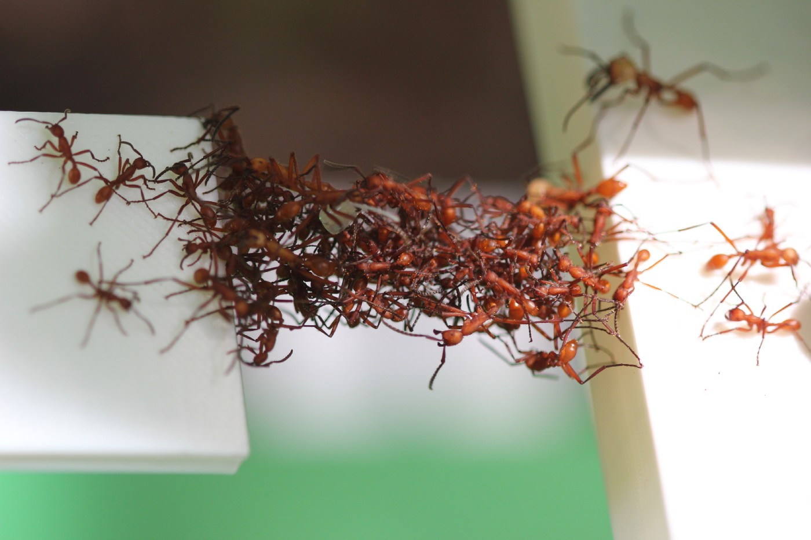

<h2 id="Research">Research</h2>
### Collective learning
### Synchronization
### Social networks

<h2 id="Projects">Projects</h2>

<h2 id="Publications">Publications</h2>

> Lulu Pan, **Haibin Shao**, Mehran Mesbahi, Yugeng Xi, and Dewei Li.
>  "**Consensus on Matrix-weighted Switching Networks**"   
>  **IEEE Transactions on Automatic Control** (2021). (To appear)

> **Haibin Shao**, Lulu Pan, Mehran Mesbahi, Yugeng Xi, and Dewei Li.   
>  "**Relative tempo of distributed averaging on networks**"   
>  **Automatica** 105 (2019): 159-166.  

> Lulu Pan, **Haibin Shao**, Mehran Mesbahi, Yugeng Xi, and Dewei Li.   
> "**Bipartite consensus on matrix-valued weighted networks**"   
>  **IEEE Transactions on Circuits and Systems II: Express Briefs** 66, no. 8 (2018): 1441-1445.  

<h2 id="Software">Software</h2>
### Neighbor selection

> A matlab code for distributed neighbor selection in multi-agent network using relative tempo amongst adjacent agents.

<h2 id="Contact">Contact</h2>
### Phone
+86 159 2153 8695
### Email
shore At sjtu Dot edu Dot cn
### WeChat
